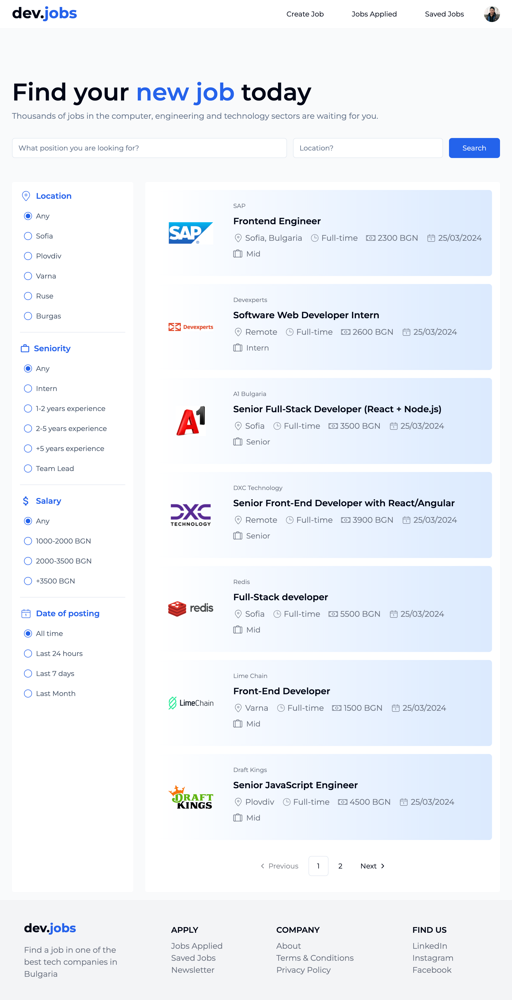
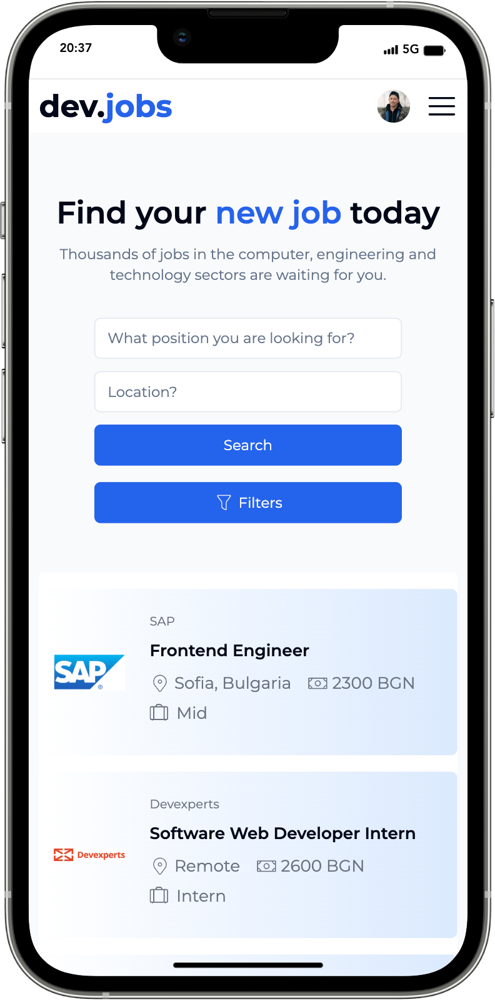

# Job Board - Documentation

## Live Demo - [Job Board](https://job-board-nine-blond.vercel.app/)

## Introduction

Job Board is a website for software job searching. It is accessible without login in, you can scroll and check all of the posted jobs. It also provides authentication to log in to have full access to all the functionalities, such as applying for a job or saving it for later. 
The application process is as simple as adding a few personal details like name, email, and CV. After each application, the user can track on a separate page to which companies have applied. 
Companies can create job listings through a detailed form which includes information regarding the company, job-related information, requirements, and benefits.

The application will get updates and new functionalities.

## Key Frames

- User Authentication
- Admin Authentication - not implemented yet
- Job Listing
- Search Functionality
- Apply Functionality
- Save Job
- Applied Jobs History
- Add Job Listing

## Installation

`Clone repo`

  - Server dev mode `cd server` `npm i` `npm run dev`
  - Client `cd client` `npm i` `npm run dev`

## Technology Stack

- React
- TypeSrcipt
- Redux
- Clerk
- PostgreSQL
- Tailwind CSS
- React Hot Toast
- React Hook Form
- React Icons
- Moment
- Axios

## Screenshots

